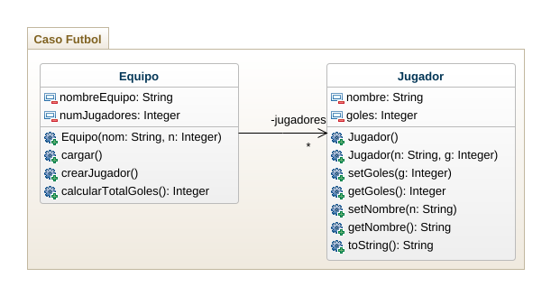

## Ejercicio - Caso 

        -> Diseño
        #Diagramas de clases

## Ejercicio - Caso equipo de futbol

1. cree una clase ejecutable para crear instancias de la clase Equipo y jugador segun requerimientos.

2. Hallar el jugador con más goles.

3. Modifique el programa para manejar la edad del jugador y calcule el promedio de edades de los jugadores.

4. Modifique el progrma para manejar el codigo del jugador y resuelva que dado el codigo, incremente los goles en 5.

#------------\Ejercicio\
La fifa a solicitado el diseño y el acceso de una app para registrar la informacion requirada sobre los 32 paises participantes en la copa mundial de futbol Qatar 2022, de cada pais debe almacenarce el nombre, el conteninte al que pertenece, el numero de participaciones en la copa del mundo, e numero de copas ganadas, los datos del director tecnico actual, la lista de los 11 jugadores titulares y la lista de 11 jugdores suplentes. de cada jugador se debe tener informacion relacionada con su nombre, apeelido, edad, posicion en el equipo y numeros de goles marcados en copas mundiales. Implemente el diagrama de clases y la app utlizando el patron MVC. 